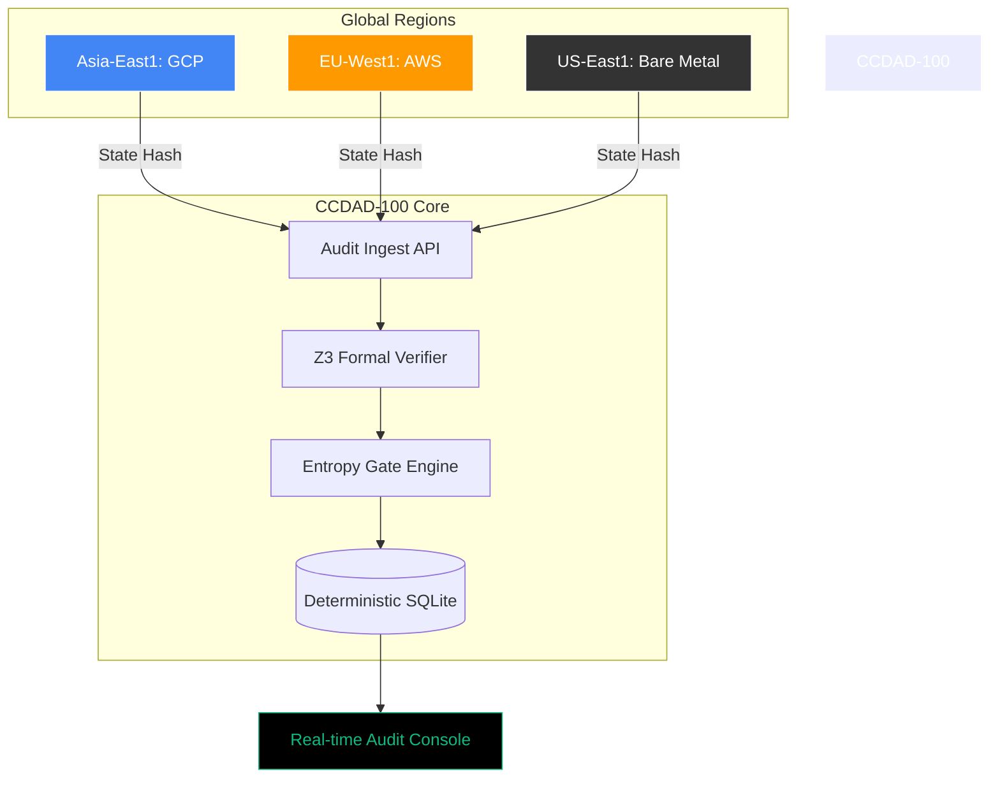

# 🛡️ CCDAD-100: Cross-Cloud Deterministic Audit Dashboard

[](https://opensource.org/licenses/MIT)
[]()
[]()
[]()

> **The Standard of Truth for Global AI Systems.**

CCDAD-100 is a high-performance, deterministic audit engine designed to ensure that distributed AI agents and systems maintain a single "source of truth" across GCP, AWS, and Bare Metal environments.

---

## 🏗️ Architecture: The Dream of Determinism



---

## 🚀 Why CCDAD-100?

In a world of distributed AI, "Consistency" is no longer enough. You need **Determinism**. CCDAD-100 provides the mathematical proof that your system hasn't diverged into a different "universe" of state.

*   **Zero-Trust Audit:** Don't trust the logs; verify the state hashes.
*   **Cross-Cloud Invariants:** Ensure $A_t^{GCP} = A_t^{AWS} = A_t^{Bare}$ at every sequence.
*   **Z3 Formal Verification:** Integrated Z3 proof consistency checks.
*   **Entropy Gating:** Automatic system freezing when non-deterministic entropy exceeds $\theta$ thresholds.

---

## 🖥️ Dashboard Overview

### 1. Determinism Matrix
Real-time grid monitoring of state alignment across global regions. Any divergence triggers an immediate **Global Freeze**.

### 2. Entropy & Gate Timeline
Visualizes the "chaos" level of the system. High entropy isn't a bug—it's a signal. CCDAD-100 gates execution when entropy signals potential non-deterministic branching.

### 3. Z3 Proof Consistency
Formal proofs are hashed and compared. If the logic differs, the system halts.

---

## 🛠️ Tech Stack

*   **Frontend:** React 19, Tailwind CSS, Recharts, Motion.
*   **Backend:** Node.js, Express, SQLite (Deterministic Log Storage).
*   **Verification:** Z3 Theorem Prover integration (API Contract).
*   **Protocol:** CCDAD-v1 Deterministic Audit Protocol.

---

## 🔌 API Specification (v1)

### Ingest Audit Event
`POST /api/v1/audit/event`

```json
{
  "epoch": "GEN5-EPOCH-001",
  "sequence": 102347,
  "region_id": "asia-southeast1",
  "state_hash": "9fa3e21...",
  "entropy": 0.83,
  "gate_result": "ALLOW",
  "z3_proof_hash": "a9f321c...",
  "signature": "ed25519:..."
}
```

### Check Global Determinism
`GET /api/v1/audit/determinism/{sequence}`

---

## 📦 Installation

```bash
# Clone the repository
git clone https://github.com/dsg/ccdad-100.git

# Install dependencies
npm install

# Start the Deterministic Engine
npm run dev
```

---

## 🤝 Contributing

We welcome contributions from the global AI safety and infrastructure community. Please see [CONTRIBUTING.md](CONTRIBUTING.md) for details.

## 📄 License

This project is licensed under the MIT License - see the [LICENSE](LICENSE) file for details.

---

**Built with 🛡️ by DSG Infrastructure Team**
